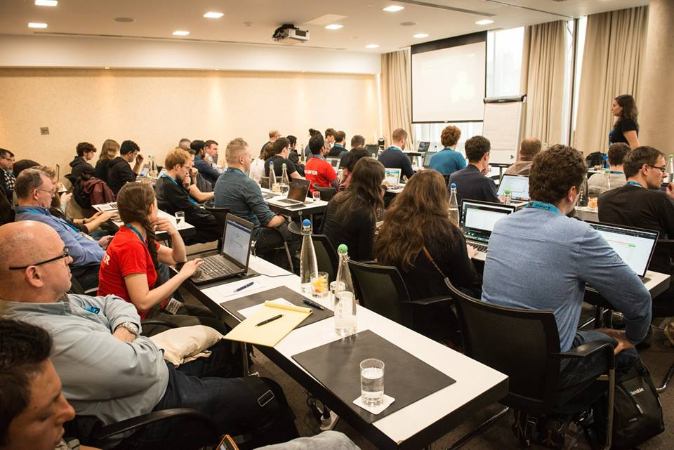

Collaborations
====================================

Column {.tabset}
------------------------------------

### Collaborations

<h5> Collaboration Events </h5>

### WIMLDS Dublin

* Contact through : Kevin O'Brien / Lais Carvalho
* Format: Contributed Talks Session 

### ML Prague

* Contact through : Kevin O'Brien
* MLPrague is a Machine Learning Conference taking place in Prague in February 2021.

### Why R? Foundation

* Contact through : Kevin O'Brien 
* Format: Youtube Webinar
* Topic: Pydata - R and Python 

### OSGeo Ireland

* Contact through : Kevin O'Brien
* Format: Contributed Talks Session 
* Open Source GIS Systems

### PyLadies Dublin

* Contact through : Lais Carvalho
* Format: Contributed Talks Session 
