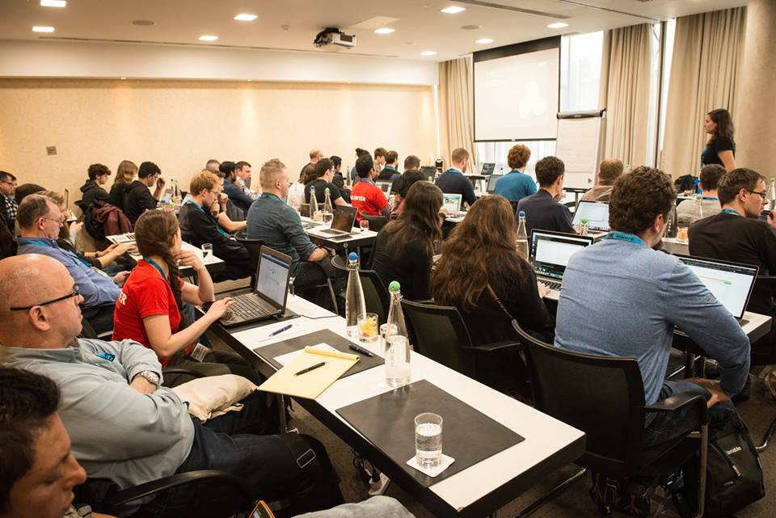

Regional
====================================

Column {.tabset}
------------------------------------

### Regional Collaborations

<h5> Regional Event </h5>

### Cork

* Lead: Urja

In these sessions, Python Ireland will be hosting joint sessions with the Python community in Cork

### Limerick

* Lead: Domas

In these sessions, Python Ireland will be hosting joint sessions with the Python community in Limerick.

### Sligo 

* This event will be ran as the NXNW Tech collaboration

### Galway

* Lead: Olga L

### Waterford

* Lead: Nicolas
