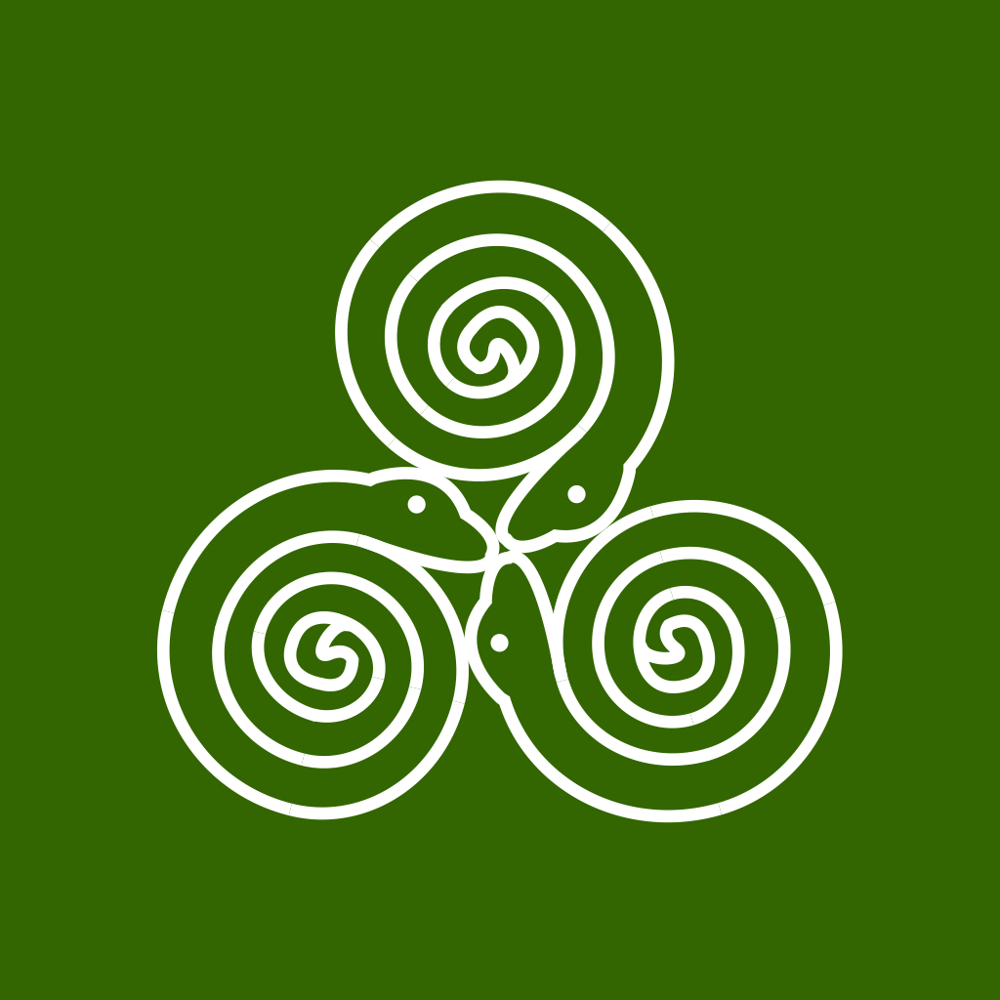
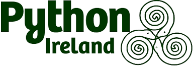

<style>                     
.navbar {
  background-color:#013228;
  border-color:white;
}
.navbar-brand {
color:white!important;
}
</style>   

<style type="text/css">

.chart-title {  /* chart_title  */
   font-size: 12px
</style>


PyCon Ireland 2020 {data-navmenu="About"}
===================================

Column {data-width=300}
--------------------

### PyCon Ireland 2020 Event Plan

<div class="container">

<div>

</div>

</div>
<center>
<h5> Event Gazette </h5>
</center>

Column {.tabset data-width=800}
--------------------------


### Pycon Ireland 2020

PyCon Ireland will take place online in November and December 2020.

(Unconfirmed Dates: Thursday 19th November to Thursday 3rd December)


### Venue ###

<h5> Venue Information </h5>


* Address: Radisson Blu Royal Hotel, 8 Golden Lane, Dublin, D08 VRR7


* GPS: Co-ordinates: 53.340902, -6.268335


* Phone: (01) 898 2900
 / International (00) 353 1 898 2900
 

### Python Ireland

<p>
<center>
<div class="container">
<div>

</div>
</div>
</center>
</p>

### Event Plan

* This event plan is a publication of details relevant to the operation of an event.

* This plan is primarily intended for potential speakers and sponsors, but can be made accessible to the general public. 

 - The site should not be considered to be the main website for PyCon Ireland 2020.

* The plan website will be updated and amended on an ongoing basis. 

 - If details are absent, the omission must not be assumed to be deliberate or permanent.

* The Python community is invited to participate in the creation of content for the event plan.

 -  Please contact Python Ireland by sending an email to "contact [at] python [dot] ie"


Call For Proposals
====================================


Column {.tabset}
------------------------------------

### Submission Process (Virtual Event)

<h5> Talk submissions </h5>


### Submission Process (Live Event)

<h5> Talk submissions </h5>

* Talk submissions can either be

  - 45 minutes long (i.e. 40 minutes for the main content and 5 minutes for questions)
  
  - 30 minutes long (i.e. 25 minutes for the main content and 5 minutes for questions)

* Python Ireland reserves the right to expedite the acceptance of submissions before the end of the CFP period, to mitigate the financial impact on the Speaker's participation.

<h5> Confirmation of Participation </h5>

* Once you have had a talk selected, kindly confirm your wish to participate as soon as possible.

* If you are unable to participate, or decide not to, please inform us as soon as possible so that we may offer the slot to another speaker.

<h5> Accomodation </h5>

* IMPORTANT: Please secure your accomodation as soon as possible.

 - There is alway events taking place in the city each weekend. 

 - You can mitigate costs by booking something immediately.


### The Everybody Pays Principle

With a view to keeping the ticket prices low and accessible to everyone, PyCons around the world use the "Everybody Pays" principle.

We confirm that this principle is observed by PyCon Ireland, even applying it to the board of directors, and the management team.

This principle is well explained in the following post by Jesse Noller:

jessenoller.com/blog/2011/05/25/pycon-everybody-pays

We point out that there are contingencies for financial aid assistance. Revert to the conference organizing team if this is something you wish to discuss.

We will not engage in discussions about the merits of this policy.

### Recording of Talks

Please note that there will be video recording of the talks, which will then be published on Youtube under the Youtube licence:

https://support.google.com/youtube/answer/2797468?hl=en


```{r child = 'Schedule.Rmd'}
```


```{r child = 'Regional.Rmd'}
```


```{r child = 'Collaborations.Rmd'}
```

```{r child = 'Workshops.Rmd'}
```


Sponsorship
====================================


Code of Conduct {data-navmenu="Participation"}
====================================

Column {.tabset}
------------------------------------

### Summary

### Response Protocol


Session Chairs {data-navmenu="Participation"}
====================================


Column {.tabset}
------------------------------------


### Session Chairs

Members of the Python community are invited to be session chairs.

#### Tasks for Session Chairing (live Events)

1. Checking the speaker is set up with Audio Visual requirements.

2. Introducing the speaker or speakers to the Audience

3. Monitoring time  - giving them 5 minute warnings. (The easiest way is just to put your hands up )

4. managing Questions and Answers

5. Thanking the speaker

6. Prompting the crowd to applaud and clap.


#### Remarks


*  When things are well prepared it is an easy job. 
*  The interesting stuff is about checking all the AV stuff.


Accessibility {data-navmenu="Participation"}
====================================


Internet Access {data-navmenu="Participation"}
============================================
Financial Aid {data-navmenu="Participation"}
=============================================

Column {.tabset}
------------------------------------------

### Financial Aid

### Reimbursment

N.N. We will only reimburse expenses from the Financial Aid Budget that were approved by the committee in advance.

To be refunded of your approved allowance, you'll need the following:

*    Having attended the conference, make sure you've been registered at the desk
*    Provide receipt for travel and/or accommodation
*    Provide your full name and address, as stated on your bank account
*    Provide a full IBAN


Organizing Team  {data-navmenu="About"}
====================================

* Kevin O'Brien
* Nicolas Laurent
* Lais Carvalho
* Stephen Finucane
* Urja Pawar
* Stephane Wirtel
